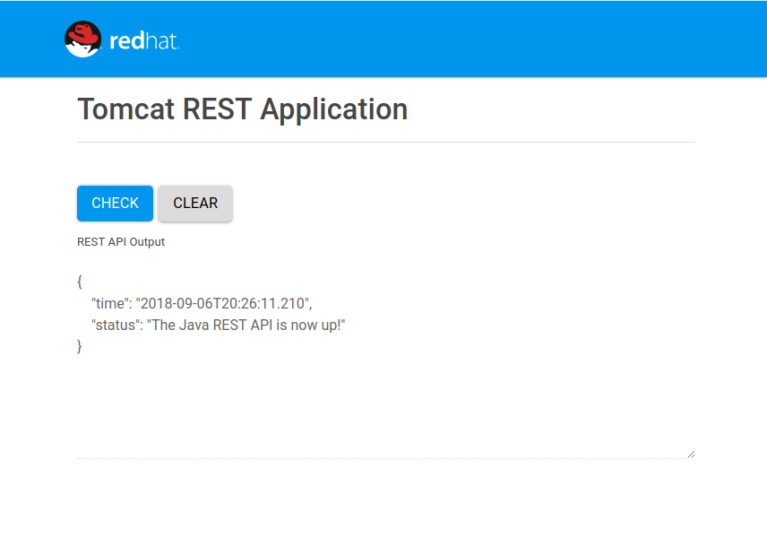

# Examples for Building Java Applications on Openshift

For developers using [Openshift](https://www.openshift.com/). Included are examples of [source to image](https://github.com/openshift/source-to-image), **source to image** binary deployment (copy the WAR), build from a **docker** file and last a [custom builder image](https://github.com/openshift/source-to-image/blob/master/docs/cli.md#s2i-create) based on Tomcat 9. Examples of when to use each:

* **s2i** covers compilation, movement of binaries and copying all custom configuration
* **docker** is needed **only** if you need root access, such as modifying a folder outside the application server directory or additional **yum** installation commands. If you are only modifying the app server deployment, docker is not needed
* **custom builder** is for application servers that are not available in a image repository like the [Red Hat Container Catalog](https://access.redhat.com/containers/)

## Requirements

* The [Container Development Kit](https://access.redhat.com/documentation/en-us/red_hat_container_development_kit/3.5/html-single/getting_started_guide/) installed. A [developers.redhat.com](https://developers.redhat.com/) account, which is free to developers, is all that is needed to install and run the enterprise tooling. 
* [docker](https://www.docker.com/get-started) for development
  * For development it is recommended to have your local docker use the [image registry](https://docs.okd.io/latest/minishift/openshift/openshift-docker-registry.html) of the Container Development Kit
* [s2i](https://github.com/openshift/source-to-image) as the build tool using docker

## Usage

Each folder has numbered bash scripts that are used to build the same basic Java Webapp in multiple ways and run using your local docker instance. By using the Container Development Kit registry you can easily spin up the application in Openshift as well via the web console.

The **builder** directory is based on the scaffolding providing from the **s2i** create command 
